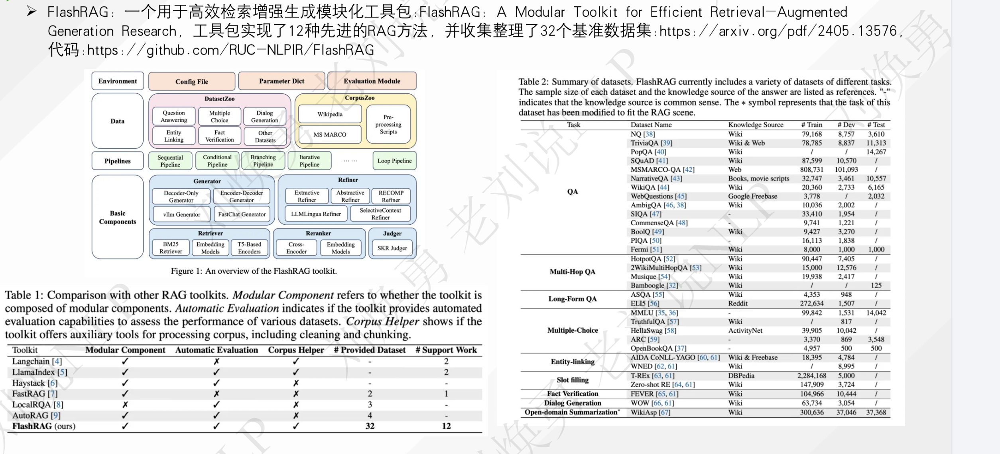
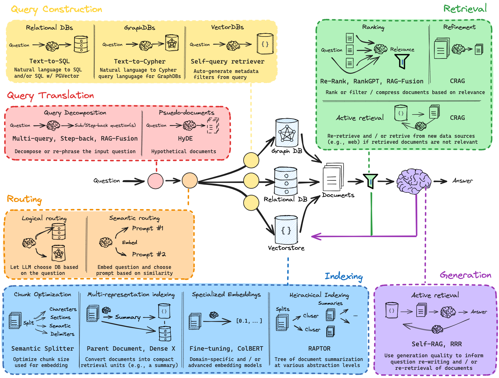

# Prompt Engineering Guide
https://www.promptingguide.ai/zh

# Retrieval-Augmented Generation for Large Language Models: A Survey
https://arxiv.org/pdf/2312.10997  

# flashrag
  

# rag-from-scratch
https://github.com/langchain-ai/rag-from-scratch?tab=readme-ov-file  
https://www.youtube.com/playlist?list=PLfaIDFEXuae2LXbO1_PKyVJiQ23ZztA0x  
  

