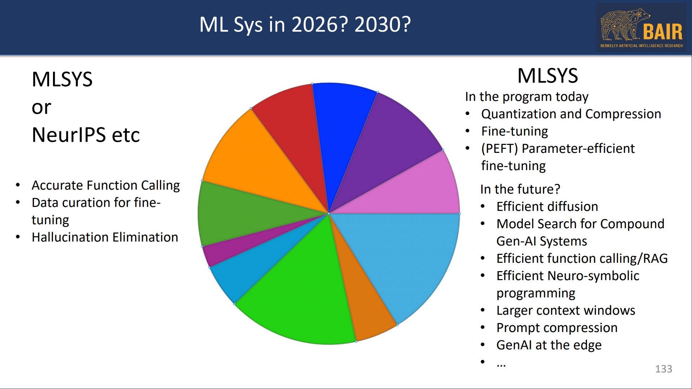
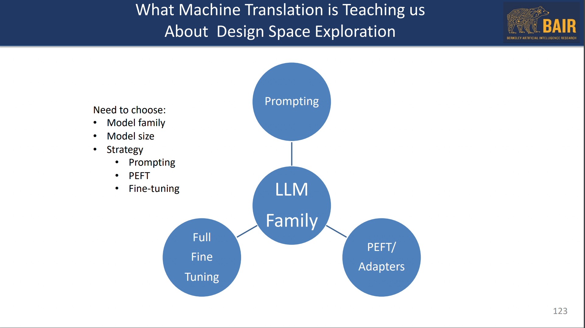
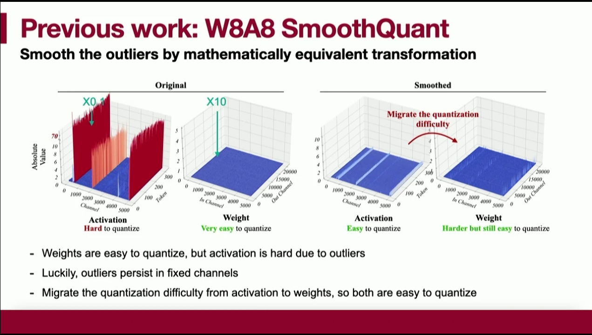
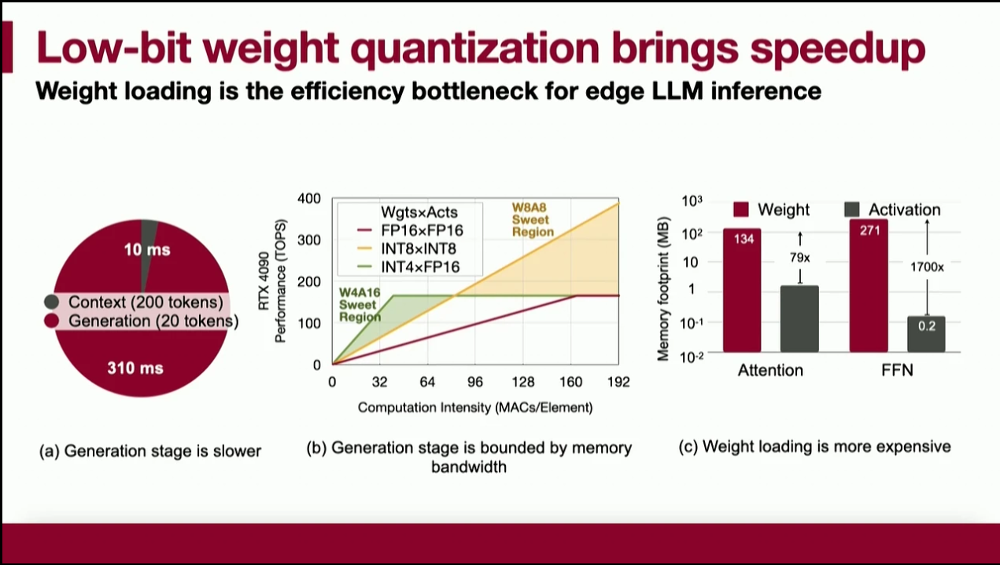
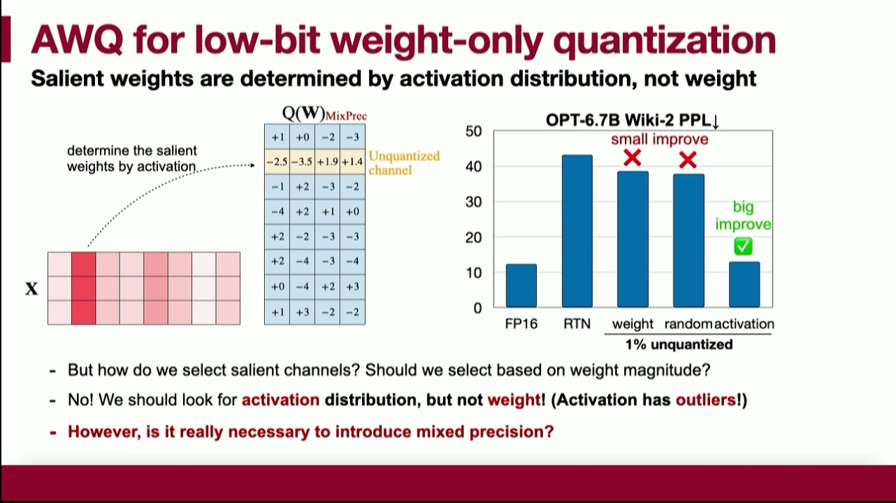

# Day1
## [GenAI Efficiency is About More than Models](https://mlsys.org/media/mlsys-2024/Slides/2668.pdf)
Kurt Keutzer@UC Berkeley  

Identify new research directions before others do  
– The first person to the beach picks up the most diamonds  

ML/DL Eras:  
• ML Era 1: Orchestration of statistics gave us Machine Learning  
• ML Era 2: Orchestration of Machine Learning algorithms gave us Neural Nets  
• ML Era 3: Orchestration of Neural Net model functions/components gave us the Transformer  
• ML Era 4: Orchestration of Transformers gave us Large Language Models  
• ML Era 5: Orchestration of Large Language Models gives us Compound GenAI Systems  
• ML Era 6: Orchestration of Compound GenAI systems give us …. What?  




## Towards Fast and Affordable Serving Systems for Large Language Models


## Memory-Efficient LLM Training

## Hardware-aware algorithms for sequence modeling

## The Unreasonable Power of Synthetics for Efficient Machine Learning

# Day2
## Quantization and Compression 1
### [AWQ: Activation-aware Weight Quantization for On-Device LLM Compression and Acceleration](https://mlsys.org/virtual/2024/poster/2653)
***Best Paper Award***
problems:
challenge for LLM deployment: colossal size, hard ro serve on edge

solution:
1. quatization can reduce deployment costs  
```
FP16: 140GB memory, need 2*80GB A100 GPUs
INT8: 70GB memory, need 1*80GB A100 GPUs
INT4: 35GB memory, need 1*40GB A100 GPUs
```
Previous Work: W8A8 SmoothQuant


Low-bit weight quantization brings speedup


AWQ:Active-aware Weight Quantization



### Possible Impossibilities and Impossible Possibilities
Yejin Choi  

## Large Language Models 1
### Q-Hitter: A Better Token Oracle for Efficient LLM Inference via Sparse-Quantized KV Cache
### Fine-Tuning Language Models Using Formal Methods Feedback: A Use Case in Autonomous Systems
### Punica: Multi-Tenant LoRA Serving
### SLoRA: Scalable Serving of Thousands of LoRA Adapters

## Parallel and Distributed 1
### DiffusionPipe: Training Large Diffusion Models with Efficient Pipelines
### Distributed Matrix-Based Sampling for Graph Neural Network Training
### L-GreCo: Layerwise-adaptive Gradient Compression For Efficient Data-parallel Deep Learning

## Privacy and security
### Accelerating ReLU for MPC-Based Private Inference with a Communication-Efficient Sign Estimation
### ACCURATE LOW-DEGREE POLYNOMIAL APPROXIMATION OF NON-POLYNOMIAL OPERATORS FOR FAST PRIVATE INFERENCE IN HOMOMORPHIC ENCRYPTION
### Proteus: Preserving Model Confidentiality during Graph Optimizations

# Day3
## LLM 2
### FlashDecoding++: Faster Large Language Model Inference with Asynchronization, Flat GEMM Optimization, and Heuristics
### Prompt Cache: Modular Attention Reuse for Low-Latency Inference
### Keyformer: KV Cache reduction through key tokens selection for Efficient Generative Inference

## AI Robustness and Security in the Age of LLMs
J. Zico Kolter  

## Quantization and Compression 2
### JIT-Q: Just-in-time Quantization with Processing-In-Memory for Efficient ML Training
### Torch2Chip: An End-to-end Customizable Deep Neural Network Compression and Deployment Toolkit for Prototype Hardware Accelerator Design
### Schrodinger's FP Training Neural Networks with Dynamic Floating-Point Containers
### Efficient Post-training Quantization with FP8 Formats

## Federated Learning
### FedTrans: Efficient Federated Learning via Multi-Model Transformation
### HeteroSwitch: Characterizing and Taming System-Induced Data Heterogeneity in Federated Learning
### LIFL: A Lightweight, Event-driven Serverless Platform for Federated Learning

## Parallel and Distributed 2
### Lancet: Accelerating Mixture-of-Experts Training by Overlapping Weight Gradient Computation and All-to-All Communication
### Disaggregated Multi-Tower: Topology-aware Modeling Technique for Efficient Large Scale Recommendation
### HeteGen: Efficient Heterogeneous Parallel Inference for Large Language Models on Resource-Constrained Devices

# Day4
## Performance and Memory
### vMCU: Coordinated Memory Management and Kernel Optimization for DNN Inference on MCUs
### SiDA: Sparsity-Inspired Data-Aware Serving for Efficient and Scalable Large Mixture-of-Experts Models
### ACROBAT: Optimizing Auto-batching of Dynamic Deep Learning at Compile Time

## Exciting Directions in Systems for Machine Learning
Jeff Dean@Google  

## Measurement and Analysis
### CloudEval-YAML: A Practical Benchmark for Cloud Configuration Generation
### Does Compressing Activations Help Model Parallel Training?
### COMET: Neural Cost Model Explanation Framework
### VIDUR: A LARGE-SCALE SIMULATION FRAMEWORK FOR LLM INFERENCE

## ML for Systems
### On Latency Predictors for Neural Architecture Search
### FLASH: Fast Model Adaptation in ML-Centric Cloud Platforms
### VQPy: An Object-Oriented Approach to Modern Video Analytics
### UniDM: A Unified Framework for Data Manipulation with Large Language Models